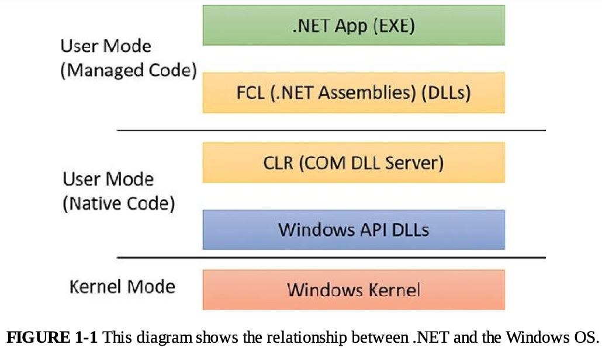

<a href = 'https://empyreal96.github.io/nt-info-depot/Windows-Internals-PDFs/Windows%20System%20Internals%207e%20Part%201.pdf'> Windows-Internals</a>

# Windows API <a href='https://learn.microsoft.com/ko-kr/windows/apps/desktop/'>microsoft</a>
- Windows Application Programming Interface
- 윈도우 운영체제에서 동작하는 응용프로그램이 운영체제의 기능 (윈도우 창 생성, 파일 입출력, 스레드 관리 등)에 접근할 수 있게 해 주는 **유저 모드 시스템 프로그래밍 인터페이스**

### COM 기반 API 
- 기존 Windows API 한계 
  - 초기 Windows는 모두 함수 기반이었기 때문에 수천 개의 전역함수가 흩어져 있었음
  - 이름 규칙 일관성이 부족하고, 논리적 그룹화가 안 되어 있어서 보수 유지가 불편했음
- COM 탄생 배경
  - COM : Component Object Model
    - 마이크로소프트가 만든 윈도우용 바이너리 컴포넌트 모델
    - 서로 다른 언어나 프로세스로 작성된 소프트웨어 구성요소들이 하나의 규약된 인터페이스를 통해 안전하게 호출, 통신할 수 있도록 설계된 규격
  - Office 애플리케이션 간 데이터 교환(OLE)의 진화 
    - Word 문서 안에 Excel 차트 넣거나 PPT에 Visio 다이어그램을 임베딩하는 것을 OLE(Object Linking and Embedding)이라 부름
    - 초기엔 DDE(Dynamic Data Exchange)라는 메시지 기반 방식이었으나 한계가 많아 OLE 2, 곧 COM으로 재탄생함 

- COM의 핵심 원칙 
  - 인터페이스를 통한 통신 
  - 바이너리 호환성
  - 동적 로딩 
- 대표적인 COM 기반 API 
  - DirectShow, Windows Media Foundation
  - DirectX, DirectComposition
  - Windows Imagining Component(WIC)
  - Background Intelligent Transfer Service(BITS)

### Windows Runtime
- WinRT의 내부 구조
  - COM 위에 구축
    - 기존 COM 모델을 기저로 삼고 여기에 완전한 타입 메타데이터 (WINMD 파일, .NET 메타데이터 포맷 기반)를 올림
    - 함수 중심의 Win32보다 네임스페이스, 일관된 이름 규칙, 프로그래밍 패턴이 훨씬 체계적
- 앱 vs 데스크톱 앱
  - windows Apps
    - 샌드박스, 라이프사이클 관리, 보안 권한 모델 같은 새로운 규칙 아래에서 실행됨
    - winRT API 전체(또는 그 서브셋)만 사용 가능
  - Desktop Apps
    - 기존 Win32, COM API(또는 그 서브셋) 전체 사용 가능
    - 필요하면 WinRT API 일부도 호출 가능
### .NET Framework 

위 사진은 windows os와 .NET 프레임워크 사이의 관계를 보여주는 다이어그램!
<block >
> .NET Framework는Windows API(Win32/COM)를 추상화한 별도의 플랫폼 계층으로 Windows API의 하위 개념이 아님!
</block>
- <a href="https://ko.wikipedia.org/wiki/닷넷_프레임워크">닷넷 프레임워크</a>란?
  - 윈도우 프로그램 개발 및 실행환경
  - 네트워크 작업, 인터페이스 등의 많은 작업을 캡슐화하고 공통 언어 런타임이라는 이름의 가상 머신 위에서 작동함