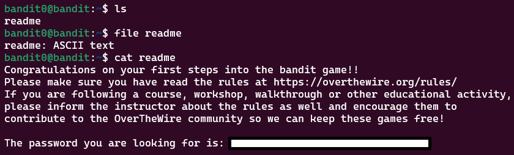

# Level Goal
이 단계에서 다음 레벨을 위한 패스워드가 readme라는 파일 안에 담겨 있다. bandit1로 향하기 위해서 해당 패스워드를 얻어야 한다.

# Commands you may need to solve this level
<a href="https://manpages.ubuntu.com/manpages/noble/man1/ls.1.html">ls</a>, <a href="https://manpages.ubuntu.com/manpages/noble/man1/cd.1posix.html">cd</a>, <a href="https://manpages.ubuntu.com/manpages/noble/man1/cat.1.html">cat</a>, <a href="https://manpages.ubuntu.com/manpages/noble/man1/file.1.html">file</a>, <a href="https://manpages.ubuntu.com/manpages/noble/man1/du.1.html">du</a>, <a href="https://manpages.ubuntu.com/manpages/noble/man1/find.1.html">find</a>
1. ls
    디렉터리 내부에 위치한 하위 디렉터리, 파일들을 보여 준다.
2. cd
    cd 뒤에 인자로 주는 디렉터리로 위치를 옮긴다. /home/test 라는 디렉터리가 있고, 현재 위치가 home일 때 `cd test` 명령을 실행하면 /home/test로 이동할 수 있다. 
3. cat
    파일 내용을 표준 출력으로 보여 준다. 
4. file
    file 뒤에 인자로 주는 파일이 어떤 파일인지를 알려 준다. readme 라는 파일이 무슨 파일인지 알고 싶을 때에는 `file readme` 명령을 실행하여 `readme: ASCII text`와 같은 출력 값을 얻을 수 있다.
5. du
    Disk Usage를 보여주는 명령어이다. 
6. find
    파일 검색 시 사용되는 명령어이다. 여러 옵션을 사용하여 원하는 파일을 찾을 수 있다. 현재 위치에서 readme라는 파일을 찾고 싶을 때에는 `find . -name "readme"` 와 같이 명령어를 입력하면 된다.

# Solution

- ls를 통해서 현재 디렉터리에 어떤 파일들이 있는지 확인
- readme는 사람이 읽을 수 있는 ASCII 텍스트 파일
- cat을 통해 readme 내부 내용 확인하면 다음 단계 패스워드를 얻을 수 있음!
