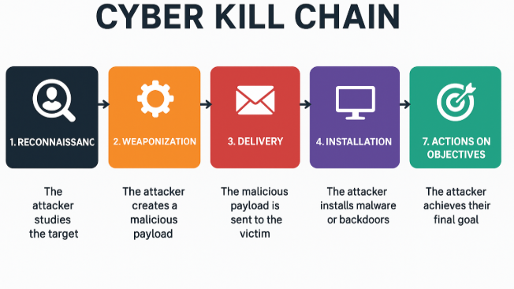
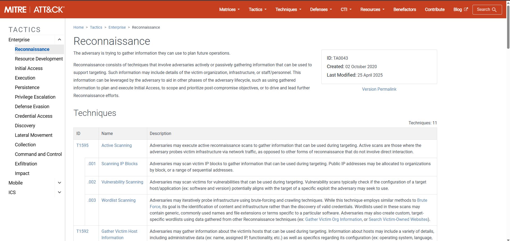
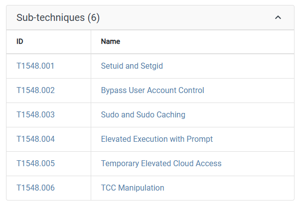
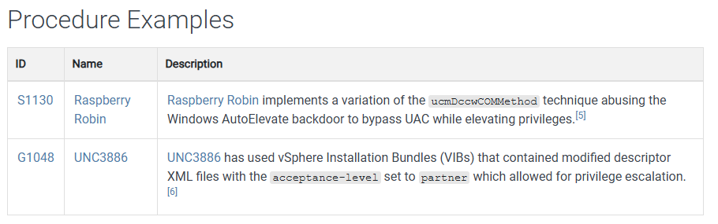
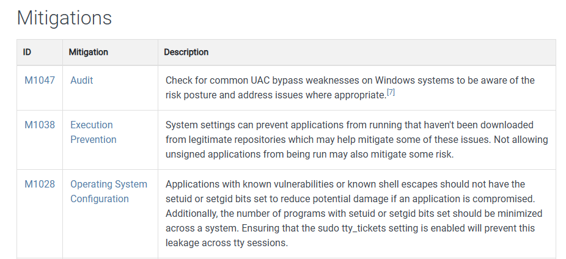
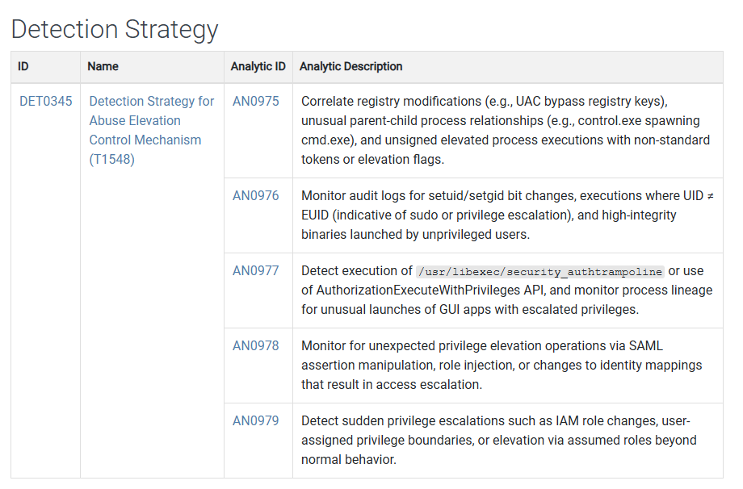
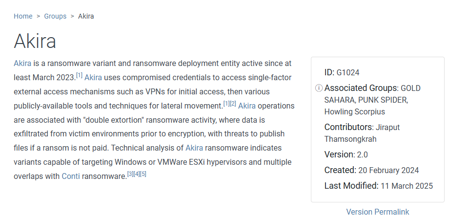
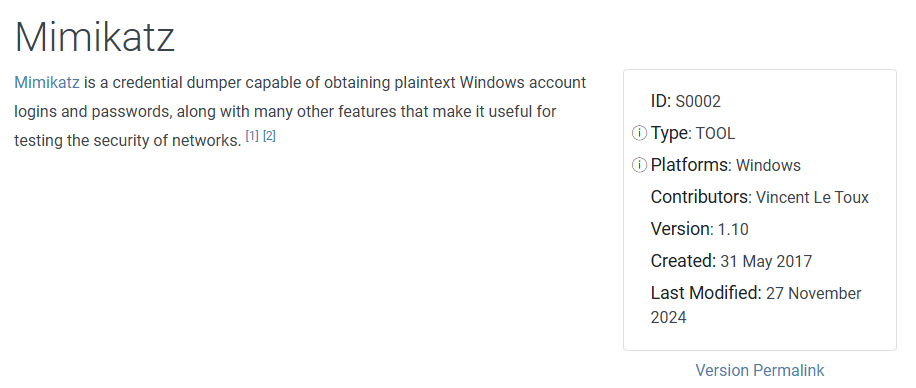

#  Introduction
## Cyber Kill Chain

사이버 킬체인이란 공격자가 목표를 달성하기 위해 거치는 공격 단계들을 일컫는다. 이미지에서 볼 수 있듯 공격의 목적을 달성하기 위해서는 정찰(Reconnaissanc), 무기화(Weaponization), 전달(Delivery), 설치(Installation), 수행(Actions on Objectives) 등의 단계를 거치게 된다. 
이 모든 단계들이 성공적으로 이루어져야만 공격의 목적을 달성할 수 있다. 군사 용어로 사용되던 kill chain에서는 chain의 한 부분을 끊어서 사건 발생을 막는 것이 중요시 되었다. 
하지만 사이버 킬 체인의 경우 시간, 진행 방향에 따른 단계를 순차적으로 작성해 둔 것일 뿐 공격 툴 및 해킹 관련 그룹에 대한 정보와의 체인이 없다는 점에서 한계가 있다. 이러한 한계점을 보완하기 위해 Mitre Att&ck Framework가 제시되었다. 
# <a href="https://attack.mitre.org/">Mitre Att&ck Framework</a>
Mitre Att&ck은 *A*dversarial *T*actics, *T*echniques, *&* *C*ommon *K*nowledge의 약자로 악의적 행위를 Tactics(공격 방법)과 Techniques(기술)의 관점으로 분석하여 공격 기법들에 대해 정보를 분류해 목록화해 놓은 표준 데이터셋이다. 
# Mitre Att&ck
## Tactics
Tactics(공격 방법)은 각 단계에 해당한다. 총 14개의 단계로 구분이 되어 있으며 각각은 정찰(Reconnaissance), 자원 개발(Resource Development), 초기 접근(Initial Access), 실행(Execution), 지속(Persistence), 권한 상승(Privilege Escalation), 방어 회피(Defense Evasion), 자격증명 접근(Credential Access), 발견(Discovery), 수평 이동(Lateral Movement), 수집(Collection), 지휘 및 통제(Command and Control), 유출(Exfiltration), 영향(Impact)으로 구분된다. 

각 Tactics에 따른 Techniques들이 제시 된다. 
위 이미지에서 볼 수 있는 Reconnaissance 단계에서는 액티브 스캐닝, 목표 호스트 정보 수집, 목표 신원 정보, 목표 네트워크 정보 수집 등 다양한 정보 수집 단계의 분류가 되어 있으며 각각 세부적으로 어떤 정보가 수집이 가능한지 하위 목록이 더 체계화 되어 있다. 
## Techniques
공격 기술에 대해 작성되어 있는 Techniques는 26년 3월 기준 현재 총 216가지의 대분류가 존재한다. 
권한 상승, 방어 회피 단계에서의 Techniques 중 하나인 <a href="https://attack.mitre.org/techniques/T1548/">Abuse Elevation Control Mechanism</a>을 대표 예로 살펴보았다. 
### sub-techniques

공격 기술을 더욱 세분화하여 어떤 식으로 공격하는지 상세히 기술되어있다.
권한 상승의 경우 대표적으로 Setuid, Setgid를 이용한 공격이 이루어지는데 이러한 공격의 경우 아래와 같이 어떻게 setuid, setgid가 설정되었고, 어떤 결과를 불러일으키는지 작성되어 있다. <a href="https://attack.mitre.org/techniques/T1548/001/">setuid, setgid를 이용한 권한 상승</a>
```
Instead of creating an entry in the sudoers file, which must be done by root, any user can specify the setuid or setgid flag to be set for their own applications (i.e. Linux and Mac File and Directory Permissions Modification). The chmod command can set these bits with bitmasking, chmod 4777 [file] or via shorthand naming, chmod u+s [file]. This will enable the setuid bit. To enable the setgid bit, chmod 2775 and chmod g+s can be used.

Adversaries can use this mechanism on their own malware to make sure they're able to execute in elevated contexts in the future.[2] This abuse is often part of a "shell escape" or other actions to bypass an execution environment with restricted permissions.

Alternatively, adversaries may choose to find and target vulnerable binaries with the setuid or setgid bits already enabled (i.e. File and Directory Discovery). The setuid and setguid bits are indicated with an "s" instead of an "x" when viewing a file's attributes via ls -l. The find command can also be used to search for such files. For example, find / -perm +4000 2>/dev/null can be used to find files with setuid set and find / -perm +2000 2>/dev/null may be used for setgid. Binaries that have these bits set may then be abused by adversaries.[3]
```
### Procedure Examples

실제로 해당하는 취약점이 악용되었던 사례, 제품에 대한 정보 또한 페이지에서 제공된다. 
### Mitigations

이 단계에서 수행될 수 있는 공격에 대응하기 위해서 어떤 Mitigation을 쓸 수 있는지 정리되어 있다. 
### Detection Strategy

이 단계에서 공격을 탐지하기 위해서 어떤 분석 방법이 필요한지, 어떤 실행, 프로세스의 사용을 감지해야 하는지를 확인할 수 있다. 

## Groups
Mitre Att&ck에서는 명칭이 있는 알려진 해킹 그룹에 대한 정보 또한 제공한다. 

해당 그룹이 어떤 악의적인 행위를 하는지, 주로 어떤 단계로 공격을 수행하는지가 정리되어 있으며 공격에 사용한 기술 또한 어떤 기술을, 어떤 도메인을 대상으로 했는지, 무엇을 위해 사용했는지를 확인할 수 있도록 정리되어 있다.

## Software
공격에 사용되었던 기본 도구나 open source 소프트웨어 등이 목록화 되어 있다. 
2026년 3월 현재 기준 총 910개의 소프트웨어 정보가 등록되어 있다. 

<a href="https://attack.mitre.org/software/S0002/">Mimikatz</a>의 페이지를 예시로 살펴보았다. 해당 소프트웨어가 어떤 소프트웨어인지 간략한 설명이 이루어진 이후, 해당 소프트웨어를 사용해 어떤 악의적인 행위가 이루어졌는지 정리되어 있다. 

---
Mitre Att&ck은 Enterprise, Mobile, ICS 버전으로 각기 다른 매트릭스를 제공한다. 조직의 상황에 맞는 도메인 매트릭스에서 제공하는 정보들을 활용하여 보안 관제, 사고 대응에 활용할 수 있어야 한다.